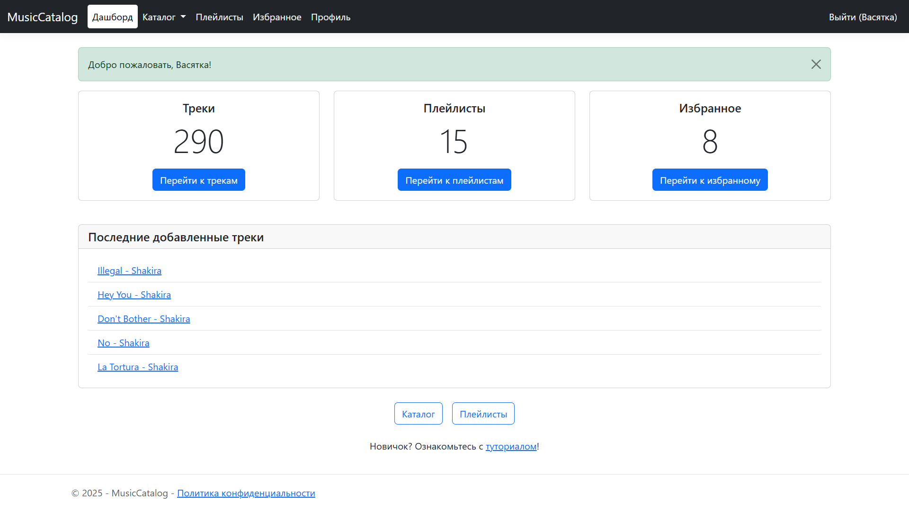
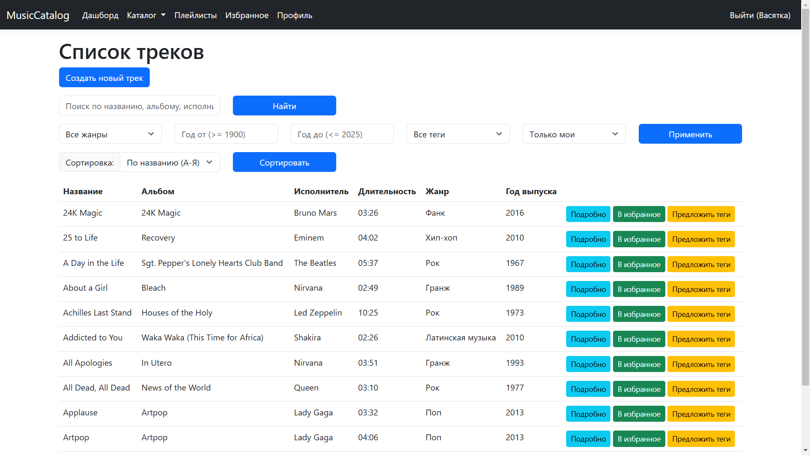

# MusicCatalog


**MusicCatalog** — это веб-приложение для управления музыкальным каталогом, разработанное на C# с использованием ASP.NET Core MVC 8.0. Приложение позволяет пользователям создавать, редактировать и искать артистов, альбомы, треки и плейлисты, поддерживает аутентификацию, роли (пользователь, администратор, гость) и модерацию контента.

## Основные возможности

- **Аутентификация и авторизация**:
  - Регистрация, вход, выход, гостевой доступ.
  - Роли: Пользователь, Администратор, Гость.
  - Проверка силы пароля и генерация случайных паролей.
- **Музыкальный каталог**:
  - Управление артистами, альбомами и треками (CRUD-операции).
  - Фильтрация по названию, жанру, году, тегам; сортировка и пагинация.
  - Добавление тегов к трекам.
- **Плейлисты**:
  - Создание, редактирование, удаление плейлистов.
  - Добавление/удаление треков с указанием порядка.
- **Избранное**:
  - Добавление артистов, альбомов и треков в избранное.
- **Модерация контента**:
  - Пользователи могут предлагать теги или публикацию контента.
  - Администраторы одобряют/отклоняют предложения.
- **Админ-панель**:
  - Управление пользователями (назначение ролей, блокировка).
  - Обработка предложений по изменениям.
- **Профиль пользователя**:
  - Редактирование логина, email и пароля.

## Технологии

- **Backend**: C#, ASP.NET Core MVC 8.0, Entity Framework Core
- **Frontend**: Razor, Bootstrap 5.3, jQuery, Select2, AJAX, клиентская валидация
- **База данных**: SQL Server
- **Аутентификация**: Cookie Authentication
- **Логирование**: Встроенное логирование ASP.NET Core
- **IDE**: Visual Studio 2022 (или другая поддерживающая ASP.NET Core)

## Требования

- .NET 8.0 SDK
- SQL Server
- Visual Studio 2022 (или другая IDE, поддерживающая ASP.NET Core)

## Установка и запуск

1. **Клонируйте репозиторий**:
   ```bash
   git clone https://github.com/<ваш-логин>/MusicCatalog.git
   cd MusicCatalog
   ```

2. **Настройте строку подключения**:
   - Откройте файл `appsettings.json`.
   - Укажите строку подключения к вашей базе данных SQL Server в секции `ConnectionStrings:DefaultConnection`:
     ```json
     "ConnectionStrings": {
       "DefaultConnection": "Data Source=ВАШ-СЕРВЕР;Initial Catalog=MusicCatalog;Integrated Security=True;Encrypt=True;Trust Server Certificate=True"
     }
     ```

3. **Примените миграции**:
   ```bash
   dotnet ef migrations add InitialCreate
   dotnet ef database update
   ```

4. **Запустите приложение**:
   ```bash
   dotnet run
   ```

5. **Откройте в браузере**:
   - HTTP: `http://localhost:5254`
   - HTTPS: `https://localhost:7034`

## Использование

- **Гости**: Просмотр публичных артистов, альбомов и треков.
- **Зарегистрированные пользователи**:
  - Создание и управление каталогом (артисты, альбомы, треки, плейлисты).
  - Добавление в избранное и предложения изменений.
  - Редактирование профиля.
- **Администраторы**:
  - Полный доступ к управлению пользователями и модерации.

## Скриншоты





## Структура проекта

- `Controllers/` — Логика обработки запросов (аутентификация, каталог, плейлисты).
- `Views/` — Razor-представления для интерфейса.
- `Models/` — Модели данных и ViewModel.
- `Context/` — Контекст базы данных (`ApplicationDbContext`).
- `wwwroot/` — Статические файлы (CSS, JS).
- `appsettings.json` — Конфигурация (строка подключения).
- `Program.cs` — Настройка приложения.

## Ограничения и планы

- Функция добавления в каталог администратором находится в разработке.
- Планируется: поддержка загрузки обложек альбомов и аудиофайлов, а также импорт и экспорт файлов.

## Лицензия

Проект распространяется под лицензией MIT.

## Контакты

- GitHub: [StepanSazykin](https://github.com/StepanSazykin)
- Email: svsazykin@edu.hse.ru

---

**© 2025 MusicCatalog**
