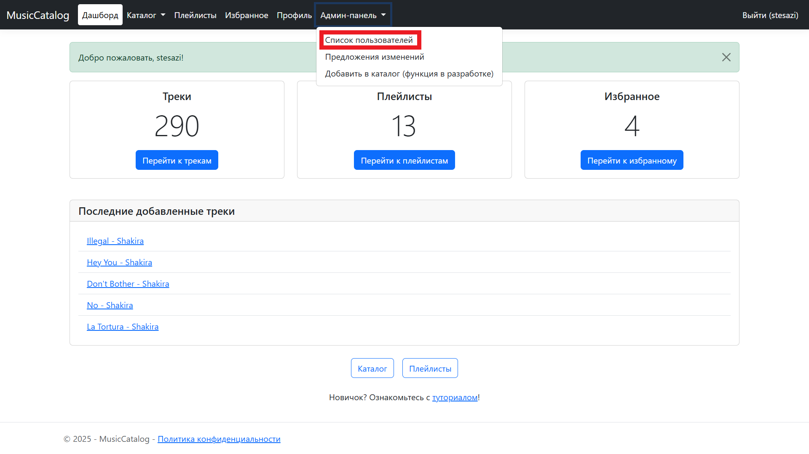
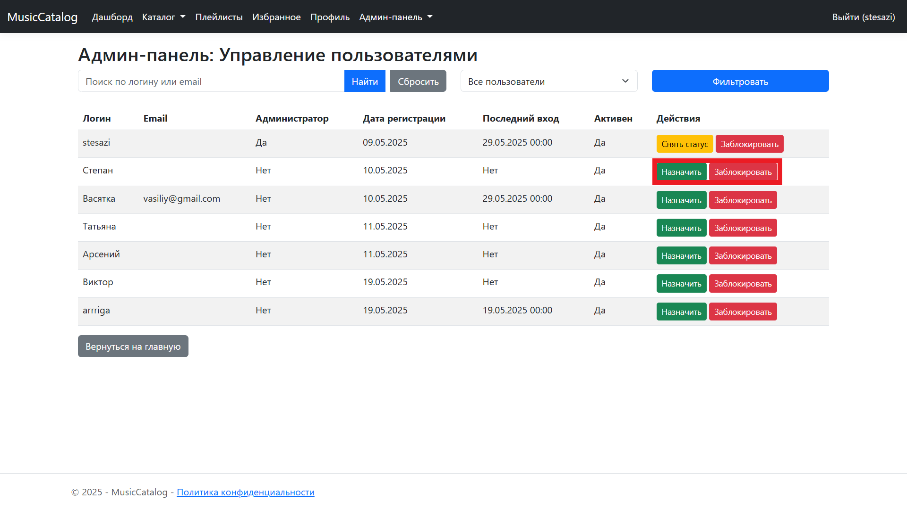
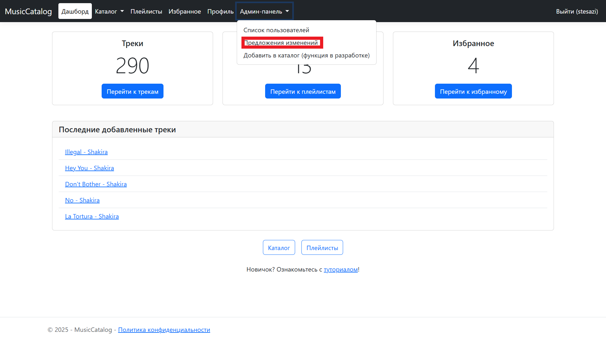
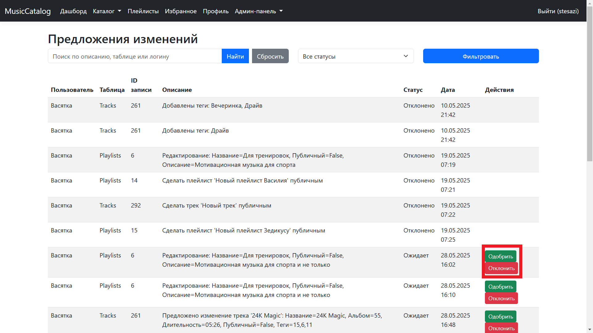
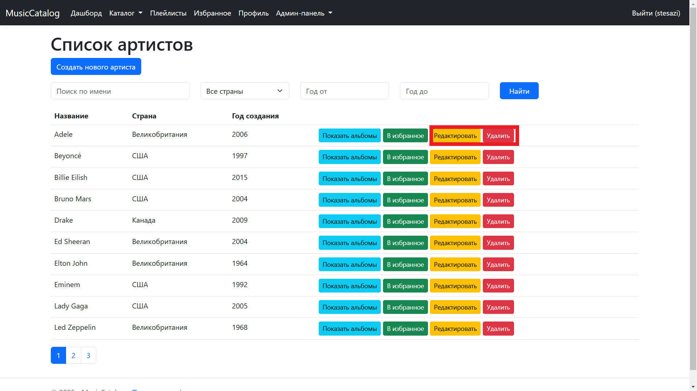
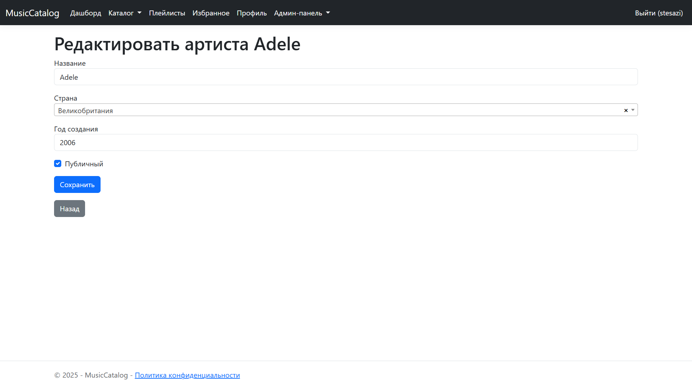

# Руководство для администраторов

## Введение
Администраторы имеют полный доступ ко всем функциям системы, включая управление пользователями и модерацию контента. Этот режим предназначен для поддержания порядка и качества данных в каталоге.

## Основные функции
- Управление пользователями: назначение ролей, блокировка/разблокировка.
- Модерация предложений: одобрение или отклонение изменений.
- Добавление контента в каталог (в разработке).
- Полный доступ к редактированию любого контента.

## Пошаговые инструкции

### Управление пользователями
1. В админ-панели выберите "Список пользователей".
   - 
2. Используйте фильтры для поиска пользователей.
3. Назначайте или снимайте роль администратора, блокируйте пользователей.
   - 

### Модерация предложений
1. В админ-панели выберите "Предложения изменений".
   - 
2. Просмотрите список предложений, отсортированных по статусу.
3. Одобрите или отклоните предложения, нажав соответствующие кнопки.
   - 

### Добавление контента в каталог (в разработке)
1. В админ-панели выберите "Добавить контент".
   - Примечание: Эта функция находится в разработке и будет доступна позже.
2. (Будет доступно) Заполните форму для добавления нового артиста, альбома или трека.
3. Сохраните изменения после завершения разработки.

### Полный доступ к редактированию любого контента
1. Перейдите в раздел "Каталог".
2. Выберите любой артист, альбом или трек.
3. Нажмите "Редактировать" (доступно только для администраторов).
   - 
4. Внесите изменения и сохраните.
   - 

## Советы и рекомендации
- Регулярно проверяйте предложения, чтобы поддерживать актуальность каталога.
- Используйте фильтры для быстрого поиска проблемных пользователей.

## Техническая поддержка
- Для технических вопросов обращайтесь на support@musiccatalog.com.
- В случае ошибок проверьте лог-файлы сервера.

## Часто задаваемые вопросы
- **Как я могу добавить нового администратора?**  
  Найдите пользователя в списке и нажмите "Сделать администратором".
- **Что делать, если пользователь нарушает правила?**  
  Вы можете заблокировать пользователя, нажав "Заблокировать".