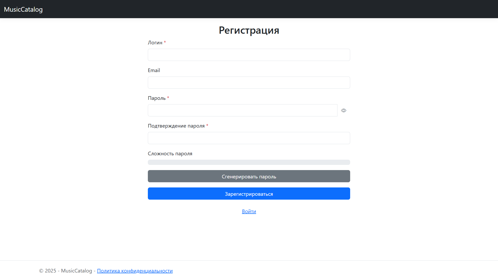
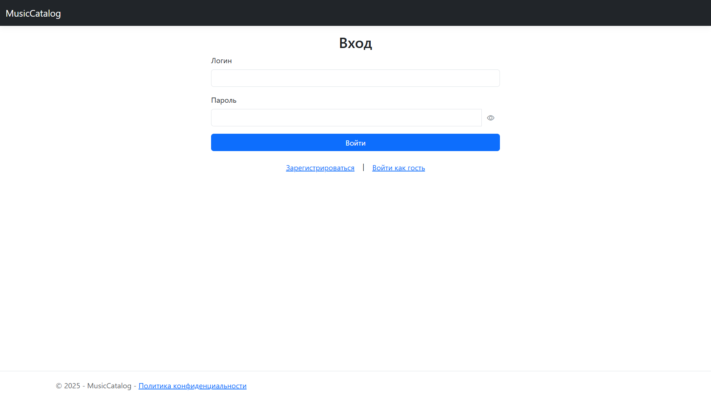
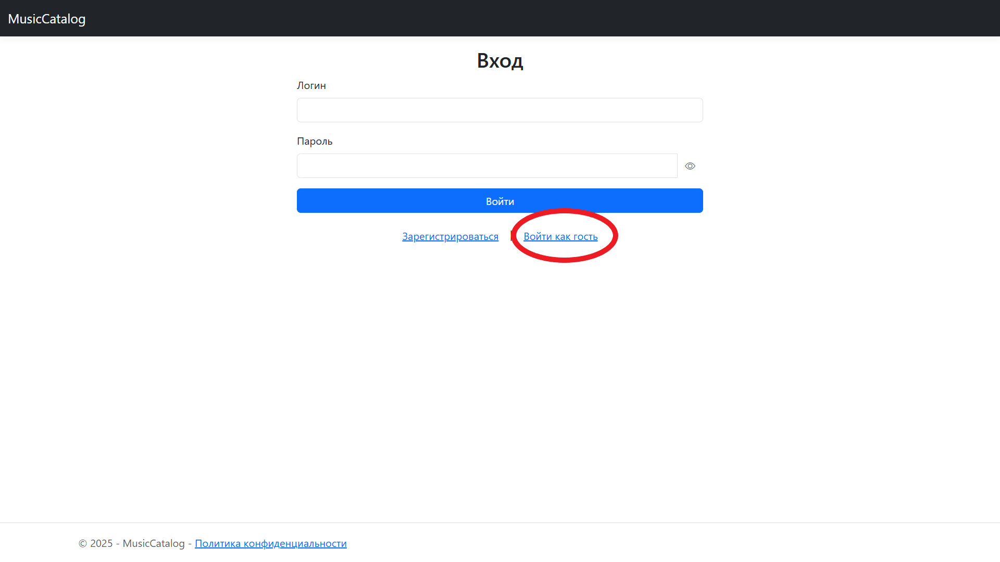

# Руководство по регистрации и входу в систему

## Введение
Этот раздел поможет вам зарегистрироваться в системе "MusicCatalog" и войти в свой аккаунт. Регистрация необходима для доступа к полному функционалу приложения, включая создание и управление музыкальным контентом.

## Основные функции
- Регистрация нового пользователя.
- Вход в систему с использованием логина и пароля.
- Вход в качестве гостя для ознакомления с публичным контентом.

## Пошаговые инструкции

### Регистрация
1. Нажмите на кнопку "Регистрация" в верхнем меню.
2. Заполните поля: Логин, Email (необязательно), Пароль, Подтверждение пароля.
   - 
3. Проверьте надежность пароля: внизу формы отображается индикатор. Зеленый цвет (Сильный) означает, что пароль надежен.
4. (Опционально) Нажмите кнопку "Сгенерировать пароль", чтобы система создала надежный пароль автоматически.
5. Нажмите "Зарегистрироваться".
6. После успешной регистрации вы будете перенаправлены на страницу входа.

### Вход в систему
1. Нажмите на кнопку "Вход" в верхнем меню.
2. Введите свой Логин и Пароль.
   - 
3. Нажмите "Войти".
4. Если данные верны, вы будете перенаправлены на главную страницу.

### Гостевой вход
1. Нажмите на кнопку "Вход как гость".
   - 
2. Вы будете авторизованы как гость и сможете просматривать каталог.

## Советы и рекомендации
- Используйте сложный пароль (сочетание букв, цифр и символов) для безопасности, иначе у вас не получится зарегистрироваться.

## Техническая поддержка
- Если возникли проблемы с регистрацией или входом, обратитесь к администратору через email: support@musiccatalog.com.
- Проверьте интернет-соединение и убедитесь, что вы используете актуальную версию браузера.

## Часто задаваемые вопросы
- **Что делать, если я забыл пароль?**  
  На данный момент функция восстановления пароля не реализована. Обратитесь к администратору.
- **Могу ли я изменить свой логин или email после регистрации?**  
  Да, вы можете изменить свои данные в разделе "Профиль".