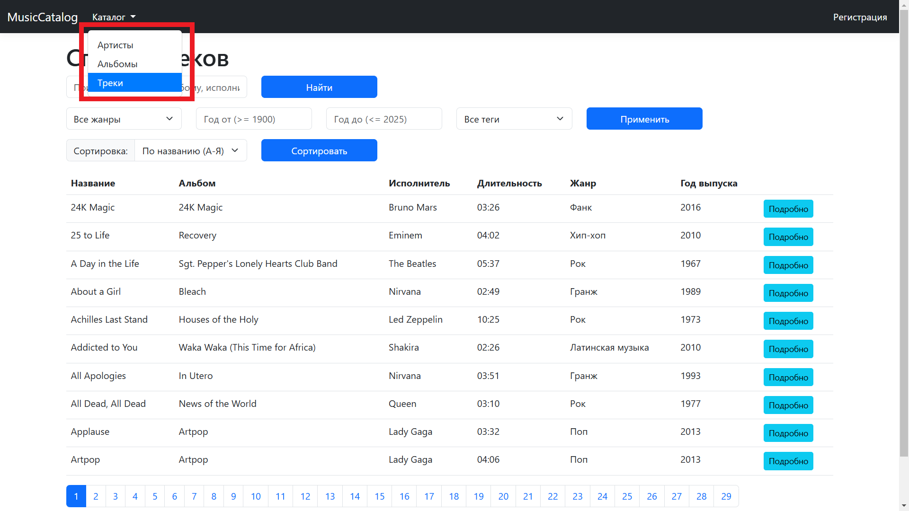
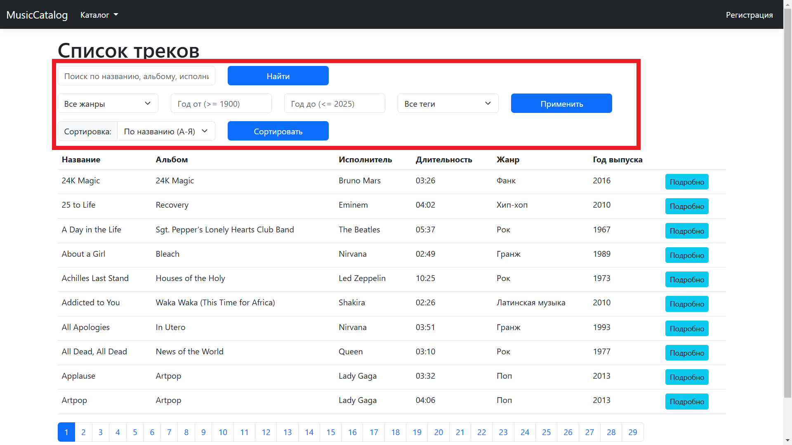
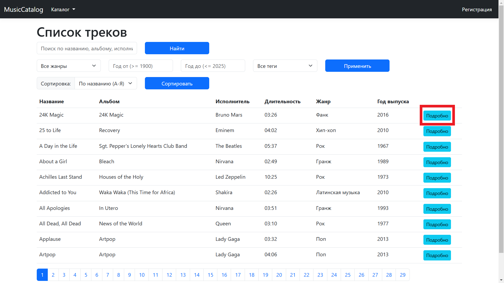

# Руководство для гостевого режима

## Введение
Гостевой режим позволяет просматривать публичный музыкальный контент без необходимости регистрации. Вы можете искать и просматривать артистов, альбомы и треки, но не можете добавлять или редактировать контент.

## Основные функции
- Просмотр списка публичных артистов, альбомов и треков.
- Фильтрация и поиск по каталогу.
- Просмотр подробной информации о треках и альбомах.

## Пошаговые инструкции

### Просмотр каталога
1. В верхнем меню выберите "Каталог" и выберите "Артисты", "Альбомы" или "Треки".
   - 
2. Используйте фильтры и поиск для нахождения интересующего контента.
   - 
3. Нажмите на название элемента, чтобы просмотреть подробную информацию.
   - 

## Советы и рекомендации
- Используйте фильтры для быстрого поиска нужного контента.
- Если ничего не найдено, попробуйте изменить параметры поиска.

## Техническая поддержка
- Для вопросов о доступности контента напишите на support@musiccatalog.com.
- Убедитесь, что ваш браузер поддерживает JavaScript.

## Часто задаваемые вопросы
- **Могу ли я добавлять треки в избранное в гостевом режиме?**  
  Нет, для этого необходимо зарегистрироваться.
- **Как мне зарегистрироваться, чтобы получить полный доступ?**  
  Нажмите "Регистрация" в верхнем меню и следуйте инструкциям.