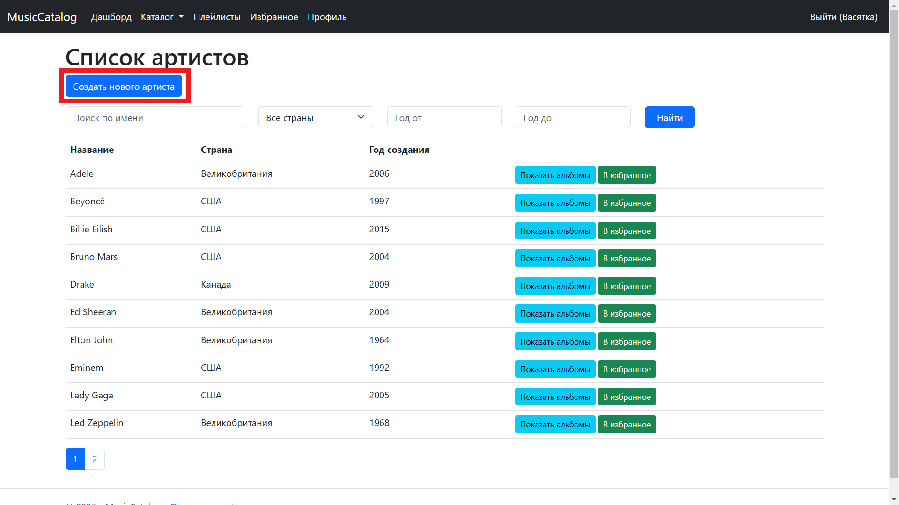
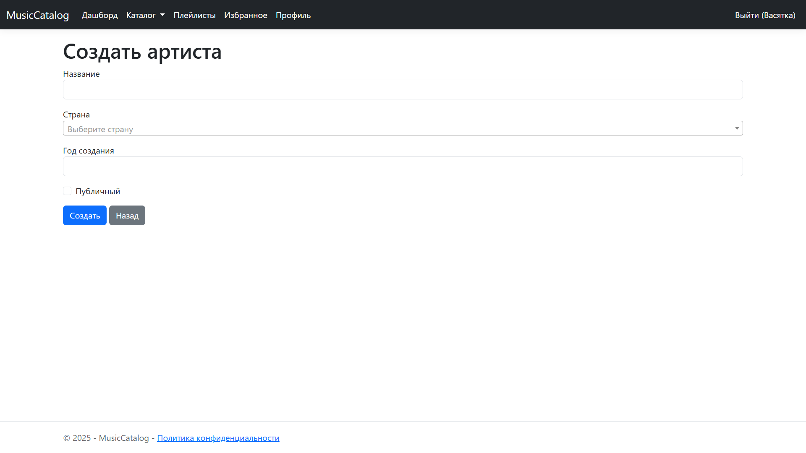
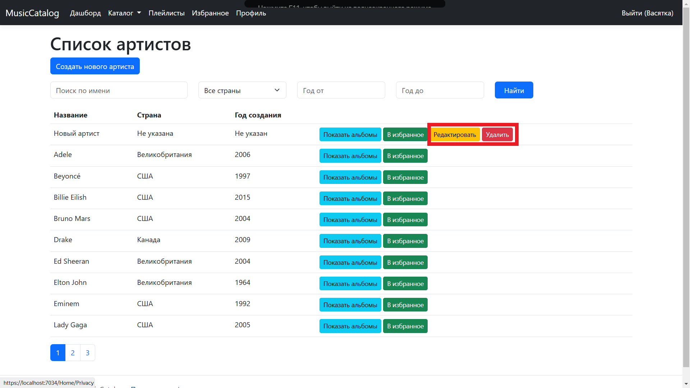
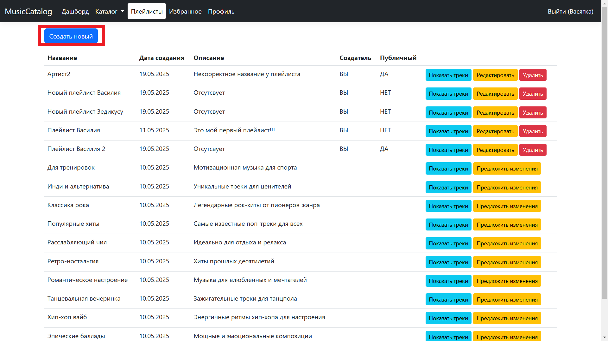
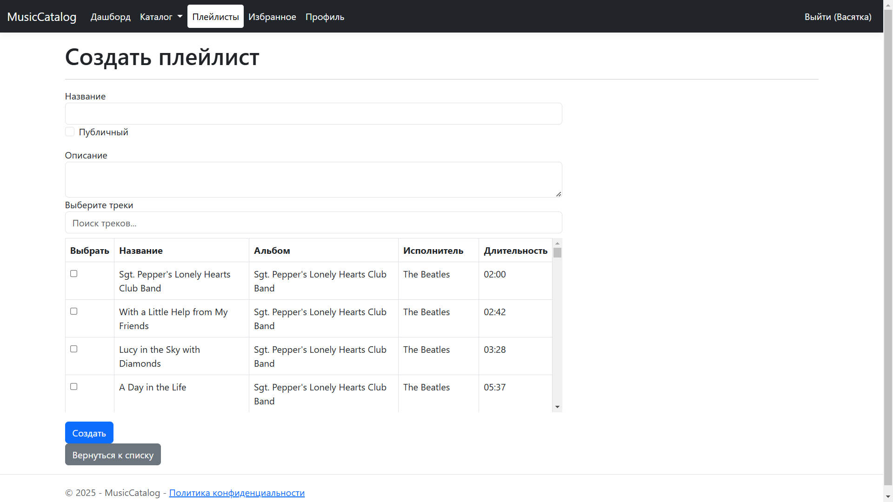
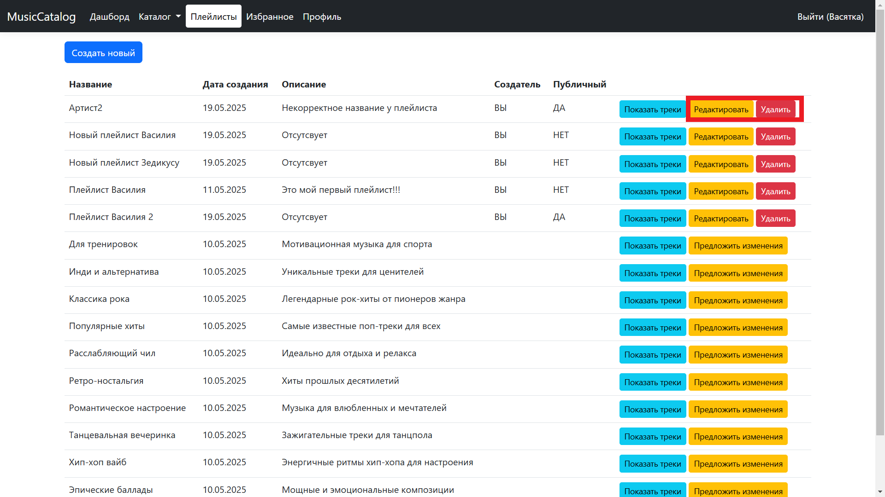
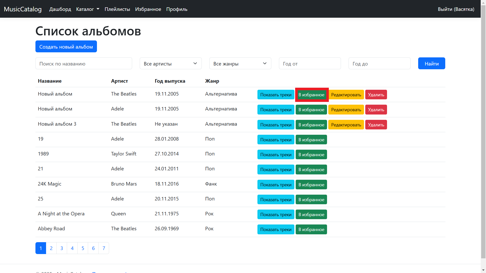
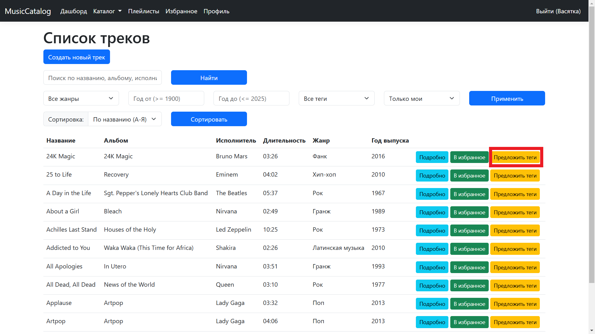
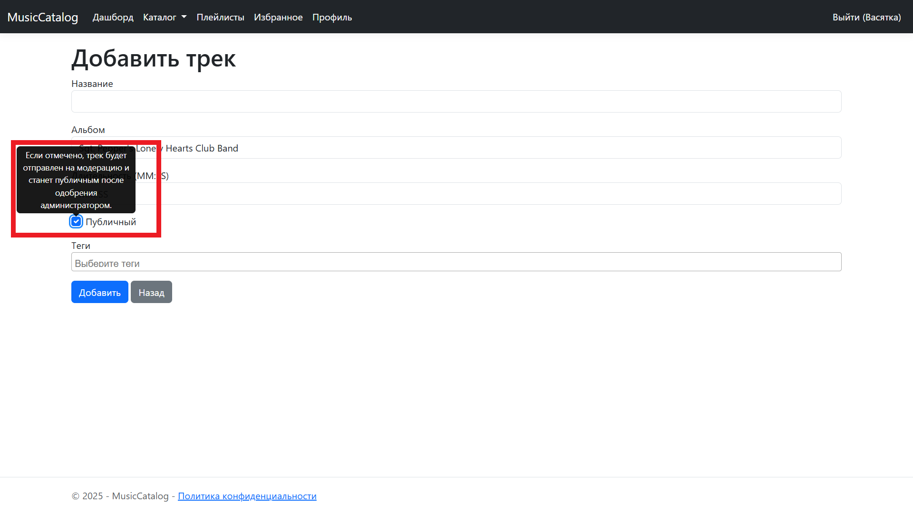
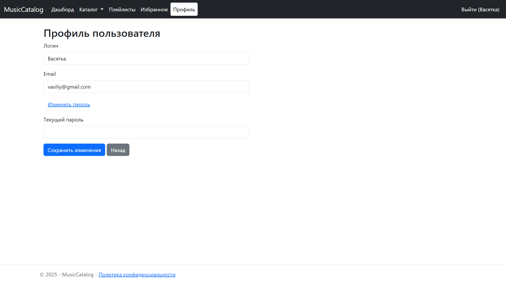

# Руководство для пользователей

## Введение
После регистрации и входа в систему вы получаете доступ к полному функционалу "MusicCatalog". Вы можете управлять своим музыкальным каталогом, создавать плейлисты, добавлять контент в избранное и предлагать изменения.

## Основные функции
- Управление артистами, альбомами и треками (создание, редактирование, удаление).
- Создание и управление плейлистами.
- Добавление контента в избранное.
- Предложение тегов и публикации контента.
- Редактирование профиля.

## Пошаговые инструкции

### Добавление нового артиста/альбома/трека
1. В разделе "Каталог" выберите "Артисты".
2. Нажмите "Создать нового артиста".
   - 
3. Заполните форму и нажмите "Сохранить".
   - 

### Редактирование или удаление артиста/альбома/трека
1. В разделе "Каталог" выберите "Артисты".
2. Найдите артиста и нажмите "Редактировать" или "Удалить".
   - 
3. Сохраните изменения или подтвердите удаление.

### Создание плейлиста
1. Перейдите в раздел "Плейлисты".
2. Нажмите "Создать новый плейлист".
   - 
3. Заполните название и описание, выберите публичность.
4. Добавьте треки из каталога и нажмите "Сохранить".
   - 

### Управление плейлистом
1. Перейдите в раздел "Плейлисты".
2. Выберите существующий плейлист и нажмите "Редактировать" или "Удалить".
   - 
3. Обновите содержимое или подтвердите удаление.

### Добавление в избранное
1. На странице трека, альбома или артиста нажмите "Добавить в избранное".
   - 
2. Просмотрите свое избранное в разделе "Избранное".
   - 

### Предложение тегов и публикация контента
1. На странице трека или альбома нажмите "Предложить теги".
   - 
2. Введите теги и отправьте предложение.
3. Для публикации контента отметьте "Публичный" при создании или редактировании и отправьте на модерацию.
   - 

### Редактирование профиля
1. Перейдите в раздел "Профиль".
2. Обновите Логин, Email или другие данные и сохраните изменения.
   - 
3. Для применения изменений необходимо ввести текущий пароль

## Советы и рекомендации
- Сохраняйте свои изменения регулярно, чтобы избежать потери данных.
- Используйте теги для удобной классификации треков.

## Техническая поддержка
- Для помощи с управлением контентом пишите на support@musiccatalog.com.
- Если страница не загружается, очистите кеш браузера.

## Часто задаваемые вопросы
- **Как сделать мой контент публичным?**  
  При создании или редактировании отметьте галочку "Публичный". Контент будет отправлен на модерацию.
- **Могу ли я редактировать чужой контент?**  
  Вы можете предлагать теги для публичных треков, но редактировать чужой контент нельзя.